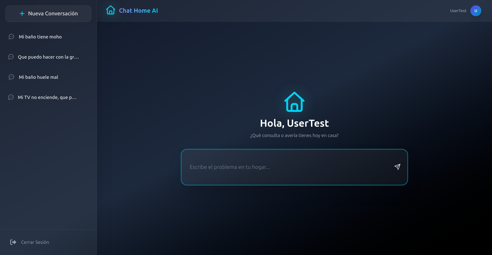

# Chat Home IA - Guía de Despliegue con Docker



Chat Home es una aplicación web diseñada como un asistente virtual inteligente especializado en la resolución de tareas y gestión de incidencias del hogar. El ecosistema está compuesto por una interfaz desarrollada en Angular 19, un backend robusto en Flask (Python) encargado de conectar con los modelos de lenguaje mediante la API de Groq, y un almacenamiento relacional con MariaDB/MySQL. La infraestructura completa se encuentra contenedorizada mediante Docker y unificada tras un proxy inverso con Nginx.


<br>


## Requisitos previos
Antes de comenzar con la instalación, es necesario asegurarse de tener instalados estos dos programas en el equipo:

1. Git (para poder clonar y descargar el código fuente).
* Linux: `sudo apt install git -y`
* Windows: Descargar desde la web oficial. https://git-scm.com/install/windows

2. Docker (el motor que ejecutará la aplicación).
* Linux: `sudo apt install docker-compose -y`
* Windows: Descargar desde la web oficial. https://docs.docker.com/desktop/setup/install/windows-install/


<br>


## Guía paso a paso para Linux (Ubuntu)

### 1. Descargar el repositorio y entrar a la carpeta del proyecto

```bash
git clone https://github.com/fcorcar/Proyecto2DAW.git
cd Proyecto2DAW
```

### 2. Configurar el direccionamiento del dominio local
Para que el proxy de Nginx intercepte correctamente las llamadas de la aplicación, añadimos el dominio local:

```bash
echo "127.0.0.1   cortes-carmona-francisco.proyecto-daw.iesabdera.local" | sudo tee -a /etc/hosts > /dev/null
```

### 3. Configurar las variables de entorno
Crea tu archivo de configuración personal a partir de la plantilla del proyecto:

```bash
cp .env.example .env
```

Abre el archivo `.env` y rellena los campos con tus credenciales reales.


### 4. Construir y levantar la aplicación completa
```bash
sudo docker-compose up -d --build
```


<br>


## Guía paso a paso para Windows
### 1. Descargar el repositorio y entrar a la carpeta del proyecto
```bash
git clone https://github.com/fcorcar/Proyecto2DAW.git
cd Proyecto2DAW
```

### 2. Configurar el direccionamiento del dominio local
1. Abre el Bloc de notas como administrador.
2. Ve a `C:\Windows\System32\drivers\etc\hosts`.
3. Añade esta línea:

```bash
127.0.0.1   cortes-carmona-francisco.proyecto-daw.iesabdera.local
```

### 3. Configurar las variables de entorno
```bash
copy .env.example .env
```

Edita el archivo `.env` con tus datos.


### 4. Construir y levantar la aplicación completa
```bash
docker-compose up -d --build
```


<br>


## Acceso a Chat Home IA
Accede desde el navegador mediante:

http://cortes-carmona-francisco.proyecto-daw.iesabdera.local


<br>


## Comandos útiles para la gestión del entorno
Ver estado de los contenedores:

```bash
sudo docker-compose ps
```

Detener la aplicación:

```bash
sudo docker-compose stop
```

Arrancar servicios:

```bash
sudo docker-compose start
```

Eliminar contenedores:

```bash
sudo docker-compose down
```

Ver logs en tiempo real:

```bash
sudo docker-compose logs -f
```