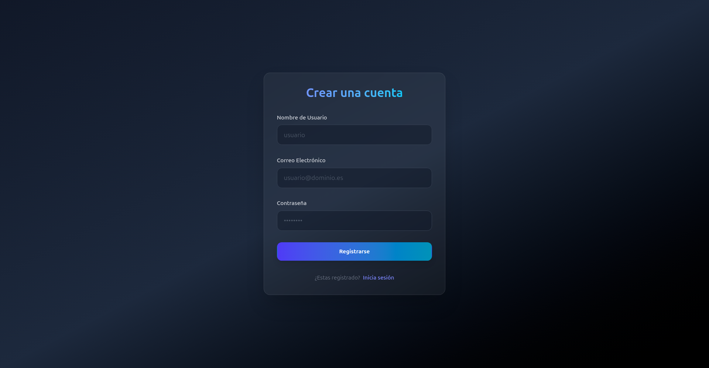
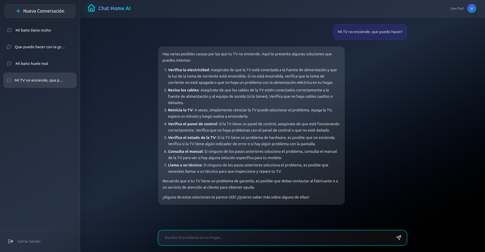

# User Manual

## 1. Introduction
Welcome to Chat Home IA, your intelligent assistant for home problems and questions. This manual is going to guide you step by step. You will learn to register and use the application easily.

## 2. Registration and Login
First, you need an account to talk to the assistant.

**Steps to register:**
1. Open the application in your browser. First, you will see the login screen.
2. You do not have an account, so click on the link "Are you new? Create an account" at the bottom of the form.
3. Fill the form with your username, email and a safe password.
4. Click the register button. If everything is fine, the system will redirect you inside the application.

**Steps to login:**
1. Open the application in your browser. First, you will see the login screen.
2. You have got an account, so fill the login form with your email and password.
3. Click the login button. If everything is fine, the system will redirect you inside the application.

## 3. How to interact with the Chat
Inside, you will enter the main chat screen directly.

**How to use it:**
1. At the bottom of the screen, there is a text bar. Write your question there (for example: "How do I clean a wine stain on the carpet?").
2. Press the **Enter** key or click the send button (the paper plane icon).
3. Wait some seconds. The AI is going to process your request and it will answer with the detailed solution on the screen.
4. You can ask more questions about the same topic or change the topic freely.

## 4. Troubleshooting
Sometimes there are problems, it is normal. Here are the solutions to the most common problems:

* **Problem:** I write my user and password but I cannot enter.
    * **Solution:** Check your caps lock. If you registered recently, make sure you are using the exact same email.
* **Problem:** I send a message in the chat but it is thinking and there is no answer.
    * **Solution:** This happens when there is no internet connection or the AI server is busy. Refresh the page (F5) and send the message again.

## 5. Frequently Asked Questions

**Is Chat Home free?**
Yes, the application is totally free for registered users.

**What happens to my data and conversations?**
Your login data is encrypted and safe. I process the conversations to give you an answer, but please do not share sensitive personal information with the AI.

**What kind of questions can I ask the chat?**
It is a specialist in home topics. You can ask about DIY, cleaning, basic repairs, cooking or household chores organization.